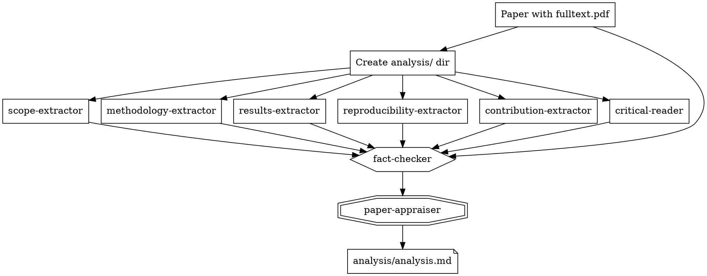

# Appraising

Critical appraisal of included papers using 8 specialized agents.

## Overview

After extraction (condense + tag), appraise papers with deep critical analysis.
Each paper gets 6 parallel analysis agents, a fact-checker, and a synthesizer.

**Core principle:** 6 agents in parallel -> fact-checker -> paper-appraiser.

**Prerequisite:** Papers must have `fulltext.pdf`. Works best after extraction (scimesh:extracting).

**Output:** `{paper_path}/analysis/` directory with 7 markdown files + `analysis.md` synthesis.

## Directory Structure

```
{review_path}/
└── papers/
    └── {year}/
        └── {paper-slug}/
            ├── index.yaml
            ├── fulltext.pdf
            ├── condensed.md        # From extracting
            └── analysis/           # From appraising
                ├── scope-extractor.md
                ├── methodology-extractor.md
                ├── results-extractor.md
                ├── reproducibility-extractor.md
                ├── contribution-extractor.md
                ├── critical-reader.md
                └── analysis.md     # Final synthesis
```

## Agents

| Agent | Model | Responsibility | Input | Output |
|-------|-------|----------------|-------|--------|
| `scope-extractor` | opus | Hypothesis, RQs, scope, biases | PDF | `analysis/scope-extractor.md` |
| `methodology-extractor` | opus | Study design, datasets, baselines, method | PDF | `analysis/methodology-extractor.md` |
| `results-extractor` | opus | Quantitative results, ablations, significance | PDF | `analysis/results-extractor.md` |
| `reproducibility-extractor` | opus | Code, data, weights, hyperparams, compute | PDF | `analysis/reproducibility-extractor.md` |
| `contribution-extractor` | opus | Contributions, novelty, citation context | PDF | `analysis/contribution-extractor.md` |
| `critical-reader` | opus | Claims vs evidence, assumptions, generalizability | PDF | `analysis/critical-reader.md` |
| `fact-checker` | opus | Verify all 6 outputs against paper | PDF + 6 outputs | Annotates 6 files inline |
| `paper-appraiser` | opus | Synthesize all into final appraisal | 6 annotated outputs | `analysis/analysis.md` |

## Workflow



## Launching Agents

### Step 1: Create the analysis directory

```bash
mkdir -p {paper_path}/analysis
```

### Step 2: Dispatch 6 agents in parallel (single message, 6 Agent calls)

```python
# ALL 6 in a single message for maximum parallelism
Agent(
    subagent_type="scimesh:scope-extractor",
    prompt=f"Analyze the paper at: {paper_path}/fulltext.pdf\nSave output to: {paper_path}/analysis/",
    description=f"Scope: {paper_slug}"
)
Agent(
    subagent_type="scimesh:methodology-extractor",
    prompt=f"Analyze the paper at: {paper_path}/fulltext.pdf\nSave output to: {paper_path}/analysis/",
    description=f"Method: {paper_slug}"
)
Agent(
    subagent_type="scimesh:results-extractor",
    prompt=f"Analyze the paper at: {paper_path}/fulltext.pdf\nSave output to: {paper_path}/analysis/",
    description=f"Results: {paper_slug}"
)
Agent(
    subagent_type="scimesh:reproducibility-extractor",
    prompt=f"Analyze the paper at: {paper_path}/fulltext.pdf\nSave output to: {paper_path}/analysis/",
    description=f"Repro: {paper_slug}"
)
Agent(
    subagent_type="scimesh:contribution-extractor",
    prompt=f"Analyze the paper at: {paper_path}/fulltext.pdf\nSave output to: {paper_path}/analysis/",
    description=f"Contrib: {paper_slug}"
)
Agent(
    subagent_type="scimesh:critical-reader",
    prompt=f"Analyze the paper at: {paper_path}/fulltext.pdf\nSave output to: {paper_path}/analysis/",
    description=f"Critical: {paper_slug}"
)
```

### Step 3: Wait for all 6 to complete

### Step 4: Dispatch fact-checker

```python
Agent(
    subagent_type="scimesh:fact-checker",
    prompt=f"""Fact-check the 6 agent outputs against the paper.
Paper path: {paper_path}/fulltext.pdf
Agent outputs directory: {paper_path}/analysis/""",
    description=f"Fact-check: {paper_slug}"
)
```

### Step 5: Wait for fact-checker to complete

### Step 6: Dispatch paper-appraiser

```python
Agent(
    subagent_type="scimesh:paper-appraiser",
    prompt=f"""Read all markdown files from: {paper_path}/analysis/
Write the final synthesis to: {paper_path}/analysis/analysis.md""",
    description=f"Appraise: {paper_slug}"
)
```

### Step 7: Confirm to user with path to analysis.md

## Batch Processing

Process multiple papers -- but each paper's pipeline is sequential (6 parallel -> checker -> appraiser).
Multiple papers can run their pipelines concurrently:

```
Paper A: [6 agents] -> [fact-checker] -> [appraiser]
Paper B: [6 agents] -> [fact-checker] -> [appraiser]
Paper C: [6 agents] -> [fact-checker] -> [appraiser]
```

**Recommended batch size:** 2-3 papers at a time (each paper dispatches 6 opus agents).

## Pre-Appraisal Check

Ask user before starting:

```python
{
    "question": f"Found {with_pdf_count} included papers with PDFs. Appraise {with_pdf_count} papers with deep critical analysis? (8 opus agents per paper)",
    "header": "Appraise?",
    "options": [
        {"label": f"Yes, appraise all {with_pdf_count} (Rec)", "description": "Deep analysis of all included papers"},
        {"label": "Select specific papers", "description": "Choose which papers to appraise"},
        {"label": "Skip", "description": "Continue without appraisal"}
    ],
    "multiSelect": False
}
```

## Progress Tracking

Create Tasks for appraisal visibility:

```python
for paper in papers_to_appraise:
    TaskCreate(
        subject=f"Appraise: {paper_title[:40]}...",
        description=f"6 extractors -> fact-checker -> appraiser for {paper_slug}",
        activeForm=f"Appraising {paper_slug}..."
    )
```

## Handling Already-Appraised Papers

Check for existing `analysis/analysis.md` before dispatching:

```python
Glob(pattern="{review_path}/papers/**/analysis/analysis.md")
```

Skip papers that already have `analysis.md` unless user explicitly requests re-appraisal.

## Common Mistakes

| Mistake | Fix |
|---------|-----|
| Running 6 agents sequentially | ALL 6 must be in a single parallel dispatch |
| Passing content in prompt to appraiser | Agents save to files -- appraiser reads from `analysis/` |
| Forgetting to create `analysis/` dir | `mkdir -p` before dispatching agents |
| Reading the paper yourself | The agents read it -- you just orchestrate |
| Dispatching too many papers at once | 2-3 papers max (each = 6 opus agents) |
| Skipping fact-checker | NEVER skip -- it catches hallucinated numbers and cross-agent inconsistencies |

## Next Step

After appraisal, the `analysis.md` files enrich **scimesh:synthesizing** -- the narrative synthesis can reference epistemic honesty scores, fragility verdicts, and critical analysis from appraisals.
